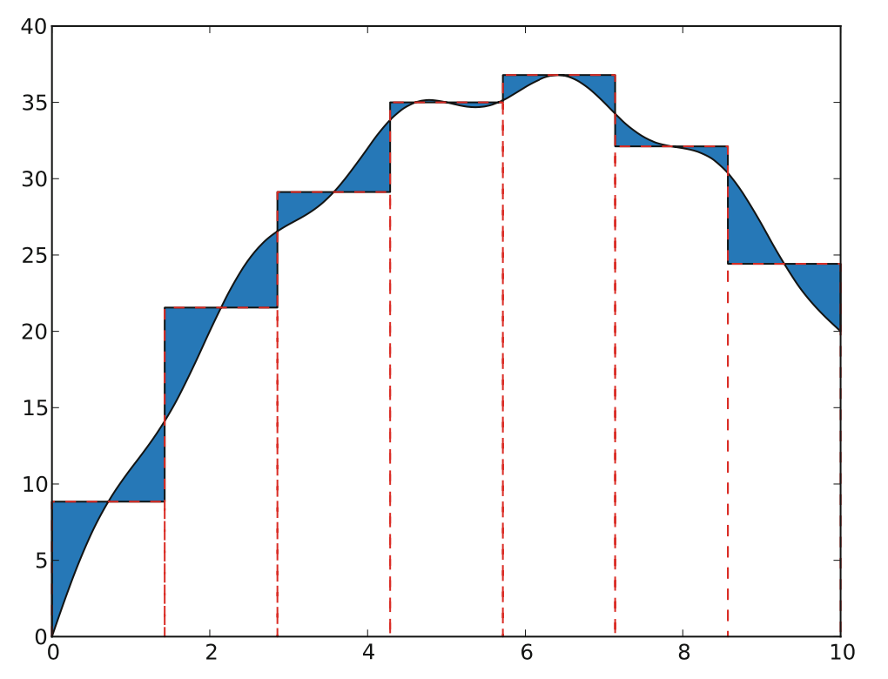

# Week 5 Task 1

In this assignment we will try to estimate the definite integral of a function. One of the simplest method is the "midpoint rule", where the integration domain is split into a set of regular and small intervals, and the area below the function within each interval is estimated from a rectangle with a width of the interval and a height of the value of the function at the midpoint of the interval

The visual representation of the idea can be seen in following image

TASK: In the midpoint.py program you can find the basic loop to perform midpoint integration of a generic function f from a to b, using a large number of small intervals. Modify the code to compute the integral of:
 
1. the sine function between 0 and pi, and
2. the cosine function between 0 and pi.

In each case, write out the error, i.e., the difference between the exact integral and the numerical result.
