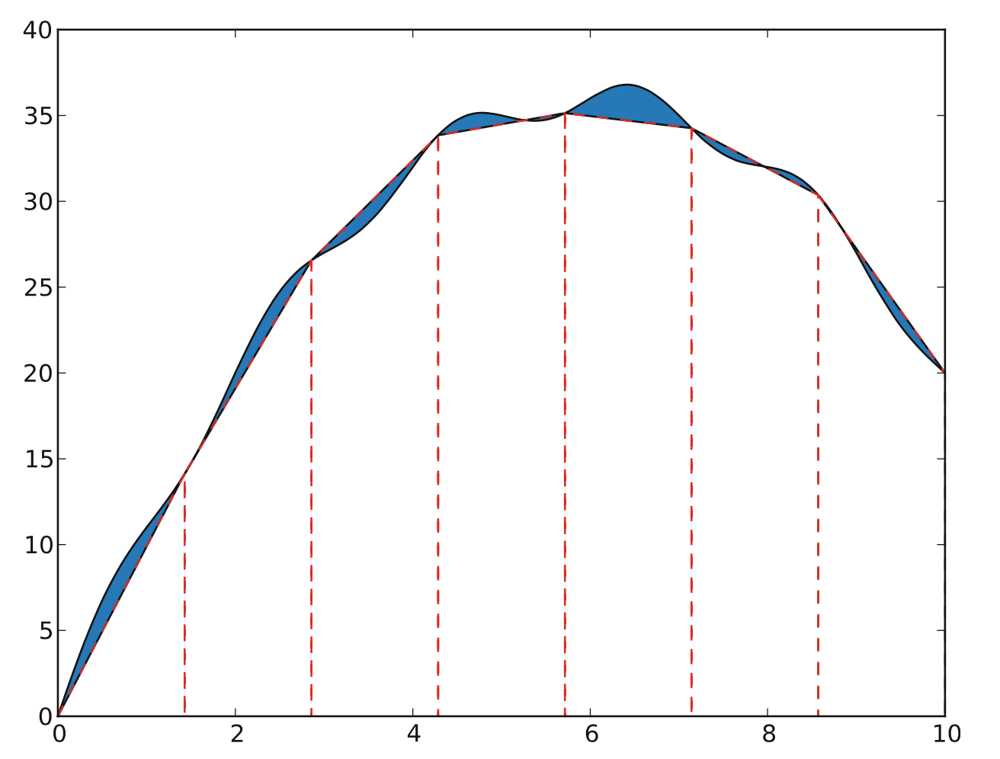

# Week 5 Task 2

Similar to Task 1, another method of numerical integration is the trapezoid rule, where the area below the function within each interval [x_i,x_i+1] is estimated from a trapezoid with its two unequal sides being f(x_i) and f(x_i+1).

Here's a visual representation 

TASK: In the trapezoid.py program you can find the basic loop to perform trapezoid integration of a generic function f from a to b, using a large number of small intervals. Modify the code to compute the integral of:
 
1. the sine function between 0 and pi, and
2. the cosine function between 0 and pi.

In each case, write out the error, i.e., the difference between the exact integral and the numerical result. Make the following comparisons:

Within the trapzoid method here, which of the two numerical integrals has a much smaller error than the other. Why?
For the sine case, how does the error from the trapezoid method compare with the error from the midpoint method using the same number of intervals?  Make your own rough sketches of the trapezoids and rectangles for the sine integral and comment on how to understand this.

